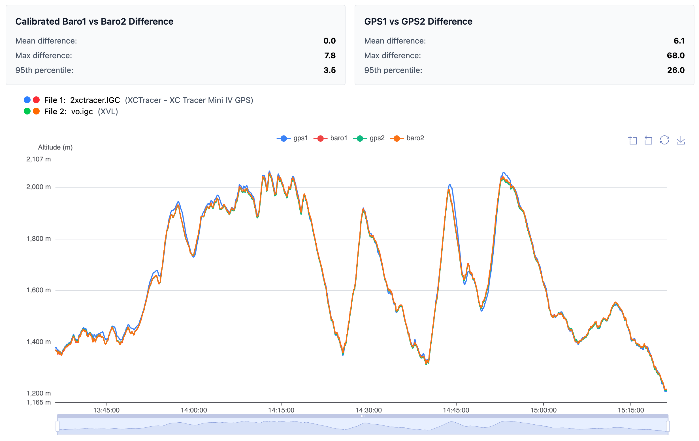

# barocompare

> Analyze and compare IGC tracks from two instruments used on the same flight

## Overview

**barocompare** helps you compare altitude data from different sensors:

- **GPS1** vs **GPS2** altitude
- **Baro1** vs **Baro2** altitude

Barometric sensors are automatically calibrated to GPS altitude using the first 60 seconds of flight data.

## Live Website

**[barocompare.hyperknot.com](https://barocompare.hyperknot.com)**



## Local Development

1. Install dependencies:
   ```bash
   pnpm i
   ```

2. Navigate to the frontend directory:
   ```bash
   cd fe
   ```

3. Start the development server:
   ```bash
   pnpm dev
   ```

4. Open the URL shown in your terminal to start developing.

## License

MIT License
